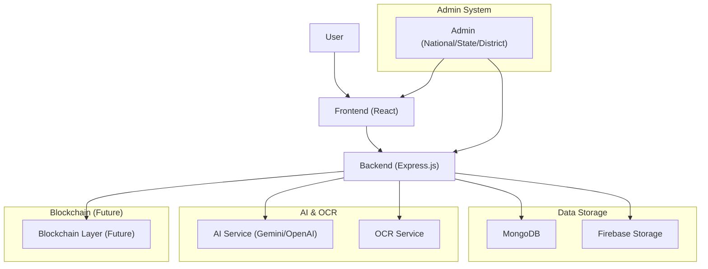
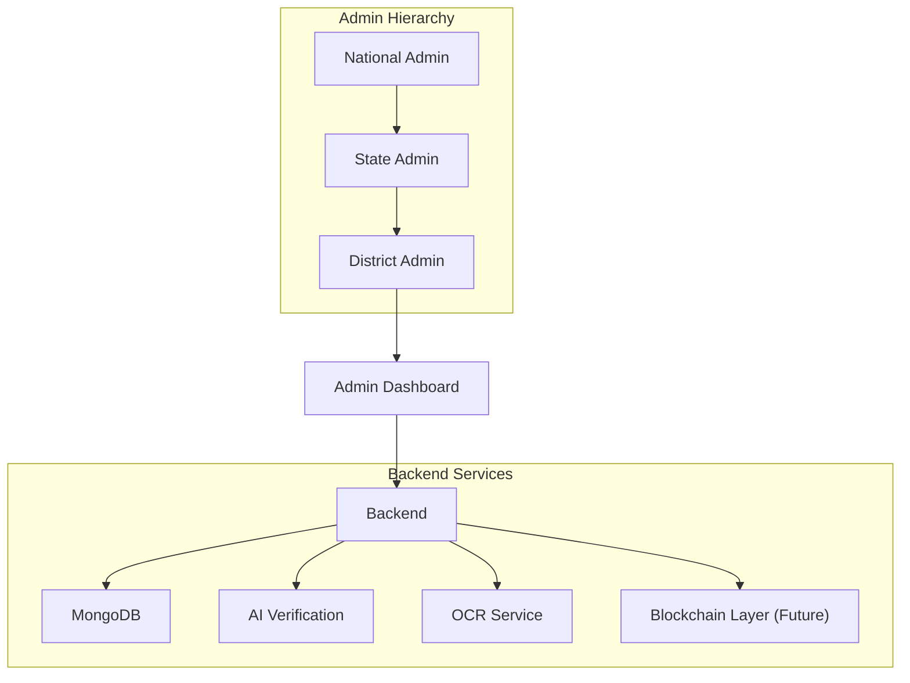

# NyaayPath – Delivering Justice to Every Doorstep 🚀

---

## 🌍 Project Overview
NyaayPath is a next-generation, **AI-powered, decentralized** platform designed to streamline and secure the process of government scheme applications and verifications. Built for hackathons and real-world impact, it leverages AI, OCR, and blockchain-ready architecture to ensure transparency, speed, and trust for both citizens and administrators.

---

## ✨ Key Features
- 🧠 **AI-Powered Address Verification:**
  - Admins can verify user-submitted addresses with a single click using Gemini/OpenAI (or any AI model) for instant fraud detection.
- 🪪 **OCR-Based ID Proof Validation:**
  - Extracts and matches details from uploaded government ID proofs using OCR, cross-verifying with user input for authenticity.
- ⛓️ **Decentralized, Blockchain-Ready Vision:**
  - Architected for future integration with blockchain to ensure tamper-proof, transparent records and decentralized trust.
- 🏛️ **Multi-Admin Hierarchy:**
  - National, State, and District admin panels for granular control and workflow management.
- 🖥️ **Modern Tech Stack:**
  - React (Vite), Express.js, MongoDB, Firebase, Tailwind CSS, Node.js, AI APIs.
- 📊 **User-Friendly Dashboard:**
  - Track application status, view details, and interact with a clean, responsive UI.

---

## 🗺️ System Architecture



---

## 🏢 Admin System Architecture



---

## 🧑‍💻 User Journey (Wireframe Flow)
1. **User** fills out the application form and uploads ID proof.
2. **Backend** stores data, files, and triggers OCR/AI checks.
3. **Admin** reviews requests in the dashboard.
4. **AI Verify Button:** Admin clicks to verify address via AI model (Gemini/OpenAI).
5. **OCR:** System extracts and matches ID proof details with user input.
6. **Status** is updated and visible to all stakeholders.

---

## 🛠️ Tech Stack
- **Frontend:** React (Vite), TypeScript, Tailwind CSS
- **Backend:** Node.js, Express.js, MongoDB (Mongoose), Firebase Admin SDK
- **AI/OCR:** Gemini/OpenAI API, Google Vision API (or Tesseract)
- **File Uploads:** Multer
- **Environment Config:** dotenv

---

## ⛓️ Decentralized Verification with Blockchain (Future Vision)

- **Every user verification (address, ID, application) will be recorded as a transaction on a public/private blockchain.**
- **No single authority can tamper with or fake the verification – all records are transparent and immutable.**
- **Smart contracts will automate the verification and approval process, ensuring trustless, peer-to-peer validation.**
- **Users will own their verification proofs and can share them securely with any government or third-party agency.**
- **This will create a truly decentralized, transparent, and citizen-empowered system for government scheme delivery.**

---

## ⚡ Quick Start

### 1. Clone the Repository
```sh
git clone https://github.com/AnupamkumarPanditOfficial/nyaaypath.git
cd nyaaypath
```

### 2. Setup Environment Variables
- Copy `.env.example` from `backend/` and fill in your credentials for MongoDB, Firebase, and AI API keys.

### 3. Install Dependencies
```sh
cd backend
npm install
cd ../
cd src
npm install
```

### 4. Run the Project
- **Backend:**
  ```sh
  cd backend
  npm start
  ```
- **Frontend:**
  ```sh
  cd src
  npm run dev
  ```

---

## 🔒 Future Scope
- Full blockchain integration for decentralized, tamper-proof records.
- Advanced AI for document forgery detection.
- Multi-language support and accessibility enhancements.
- Real-time notifications and analytics for admins.

---

## 🏆 Why Judges Will Love It
- **Innovative:** Combines AI, OCR, and decentralized vision.
- **Practical:** Solves real-world problems for government workflows.
- **Scalable:** Ready for future tech (blockchain, advanced AI).
- **User-Centric:** Clean UI, clear flows, and robust security.

---

## 🙌 Contributing
Pull requests are welcome! For major changes, please open an issue first to discuss what you would like to change.

---

## 📄 License
[MIT](LICENSE)

---

> **Note:**
> - Diagrams are rendered using [Mermaid](https://mermaid.js.org/). If you don't see diagrams, view this file on GitHub or a Mermaid-enabled viewer for best results. 